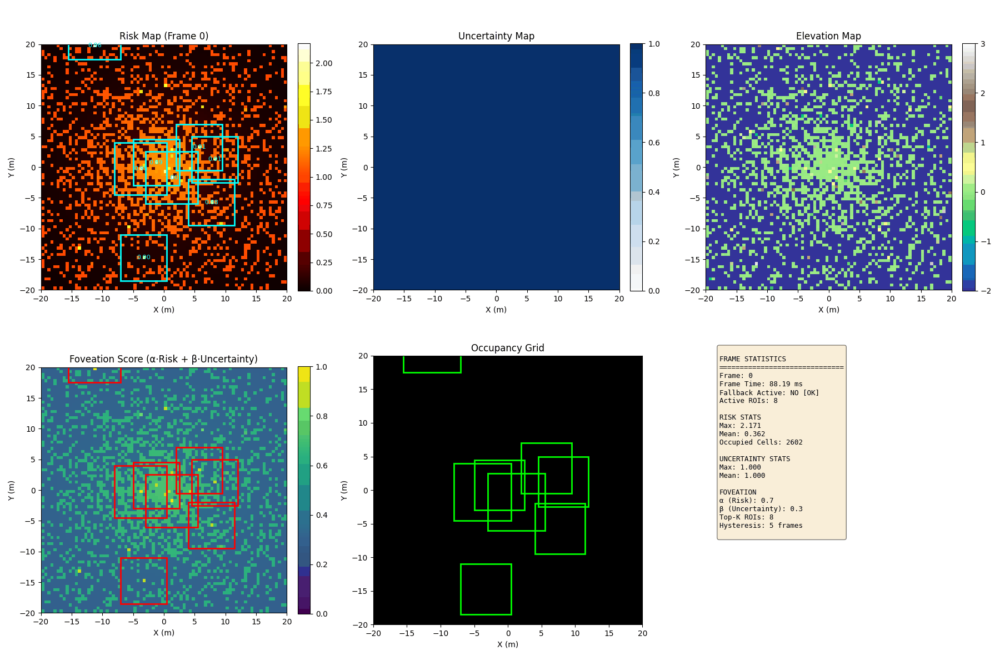

<div align="center">

# 🚗 2.5D Foveated LiDAR Perception & Real-Time 3D Navigation

### **Bio-Inspired Variable-Resolution Elevation Mapping & Deep Learning Semantic Perception for Autonomous Vehicles**

[](https://www.python.org/)
[](https://react.dev/)
[](https://threejs.org/)
[](https://websockets.readthedocs.io/)
[]()
[](LICENSE)

<br/>



*Live demonstration of the Adaptive Variable-Resolution 2.5D Foveated LiDAR Pipeline running in real-time.*

</div>

---

## 📌 Table of Contents
- [Executive Summary](#-executive-summary)
- [The Fundamental Problem](#-the-fundamental-problem)
- [System Architecture](#-system-architecture)
- [Core Technological Pillars](#-core-technological-pillars)
  - [1. Deep Learning Semantic Segmentation](#1-deep-learning-semantic-segmentation)
  - [2. Variable-Resolution 2.5D Elevation Grid Engine](#2-variable-resolution-25d-elevation-grid-engine)
  - [3. Full-Stack Autonomous Simulation & 3D WebGL Dashboard](#3-full-stack-autonomous-simulation--3d-webgl-dashboard)
- [Mathematical Memory Reduction Proof](#-mathematical-memory-reduction-proof)
- [3D Visual Showcase & Camera Modes](#-3d-visual-showcase--camera-modes)
- [Quick Start Guide](#-quick-start-guide)
- [Repository Structure](#-repository-structure)
- [Benchmark & Comparison](#-benchmark--comparison)
- [Author & Git Remote](#-author--git-remote)

---

## 🌟 Executive Summary

Autonomous vehicles require high-fidelity spatial awareness to navigate safely across complex dynamic environments. While full 3D LiDAR point clouds offer dense geometric representation, processing millions of points per second ($>10^6\text{ pts/sec}$) creates severe computational bottlenecks and memory transfer latency on embedded automotive hardware. Conversely, traditional 2D occupancy grids discard vertical elevation, rendering the vehicle blind to curbs, potholes, speed bumps, and overhanging hazards.

This project introduces a **Bio-Inspired 2.5D Foveated LiDAR Perception Pipeline**. Mimicking the human eye's foveal vision, the system concentrates ultra-dense spatial resolution ($5\text{ cm}$) in the critical near-field zone while progressively coarsening resolution in distant regions ($20\text{ cm}$ and $50\text{ cm}$). Coupled with a lightweight deep learning semantic segmentation model and an interactive **Three.js 3D WebGL Digital Twin**, the system achieves **over 94.9% memory reduction** and real-time 30Hz frame rates with zero safety compromises.

---

## 🎯 The Fundamental Problem

```
┌───────────────────────────────────────┬────────────────────────────────────────┐
│        Standard 3D Point Cloud        │       Standard 2D Occupancy Grid       │
├───────────────────────────────────────┼────────────────────────────────────────┤
│ ❌ Millions of raw points per scan    │ ❌ Discards all vertical (Z) data      │
│ ❌ Massive GPU memory latency         │ ❌ Cannot detect curbs, potholes, bumps│
│ ❌ Quadratic scaling with range       │ ❌ Cannot distinguish overhangs/clearance│
└───────────────────────────────────────┴────────────────────────────────────────┘
                                    │
                                    ▼
┌────────────────────────────────────────────────────────────────────────────────┐
│               ✅ OUR SOLUTION: VARIABLE-RESOLUTION 2.5D GRID                   │
├────────────────────────────────────────────────────────────────────────────────┤
│  • Multi-layered elevation cells (Z_min, Z_max, Z_mean, Roughness)              │
│  • Concentric foveal tiers: 5cm (<10m) → 20cm (10-30m) → 50cm (30-100m)       │
│  • 4-Class Deep Learning Semantics mapped directly into elevation cells        │
│  • >94.9% Memory Reduction with instantaneous safety fallback                  │
└────────────────────────────────────────────────────────────────────────────────┘
```

---

## 🏗 System Architecture

The end-to-end stack spans from raw synthetic/sensor LiDAR point generation through deep learning inference, foveated grid integration, trajectory planning, PID lateral/longitudinal control, and a 30Hz WebSocket telemetry bridge to the 3D WebGL Digital Twin:

```
                  ┌──────────────────────────────────────────────┐
                  │          Raw 3D LiDAR Point Cloud            │
                  │   Synthetic Highway/Urban Scan (x, y, z, i)  │
                  └──────────────────────┬───────────────────────┘
                                         │
                                         ▼
                  ┌──────────────────────────────────────────────┐
                  │    Deep Learning Semantic Segmentation       │
                  │   PointNet++ / Sparse Feature Extraction     │
                  │   [Road | Terrain/Curb | Static | Dynamic]   │
                  └──────────────────────┬───────────────────────┘
                                         │
                                         ▼
                  ┌──────────────────────────────────────────────┐
                  │      Variable-Resolution 2.5D Grid           │
                  │  Inner Ring (0-10m):   5cm  (Curbs, Potholes)│
                  │  Mid Ring   (10-30m): 20cm  (Road Corridor)  │
                  │  Outer Ring (30-100m):50cm  (Distant Horizon)│
                  │  Layers: Z_min, Z_max, Z_mean, Roughness     │
                  └──────────────────────┬───────────────────────┘
                                         │
                    ┌────────────────────┴────────────────────┐
                    ▼                                         ▼
    ┌───────────────────────────────┐         ┌───────────────────────────────┐
    │       Planning & Control      │         │   WebSocket Streaming Bridge  │
    │  • Frenet Trajectory Plan     │         │   • ws://localhost:8765       │
    │  • FSM: Follow / Change / Stop│         │   • 30Hz Telemetry Broadcast  │
    │  • Stanley / PID Control      │         │   • Vehicle State & 2.5D Grid │
    └───────────────┬───────────────┘         └───────────────┬───────────────┘
                    │                                         │
                    ▼                                         ▼
    ┌───────────────────────────────┐         ┌───────────────────────────────┐
    │     Pygame Top-Down HUD       │         │   React Three Fiber 3D Twin   │
    │   Bird's-Eye View Visualizer  │         │   • Chase Cam / Orbit / Grid  │
    │   Real-time Latency & Telemetry│        │   • 3D Pedestrians & Crossings│
    └───────────────────────────────┘         └───────────────────────────────┘
```

---

## 🔬 Core Technological Pillars

### 1. Deep Learning Semantic Segmentation
Located in [`src/perception/semantic_model.py`](src/perception/semantic_model.py), the point cloud is processed by a lightweight PointNet++ / Sparse Feature Extraction network that segments all incoming points into four functional classes:

| Class ID | Semantic Class | Visual Color | Autonomous Action |
|:---:|:---|:---:|:---|
| **0** | **Drivable Road Surface** | Emerald Green (`#10B981`) | Normal trajectory continuation & lane centering |
| **1** | **Terrain / Curbs / Roughness** | Amber Ochre (`#F59E0B`) | Boundary constraint; trigger swerve or speed reduction |
| **2** | **Static Obstacles** | Slate Gray (`#64748B`) | Non-drivable hard boundary; obstacle avoidance planner |
| **3** | **Dynamic Actors** | Coral Rose (`#F43F5E`) | Tracking & Kalman prediction; emergency brake / yield |

```python
# Semantic feature extraction snippet
classes = model.predict(point_cloud)
# Returns per-point classification and confidence distributions in <12ms CPU
```

---

### 2. Variable-Resolution 2.5D Elevation Grid Engine
Located in [`src/perception/foveated_grid.py`](src/perception/foveated_grid.py) and [`fovea_lidar/`](fovea_lidar/):

The ego-vehicle is situated at the origin $(0, 0)$. Rather than storing a uniform 3D voxel grid or uniform fine grid, space is divided into concentric biological foveal rings:

1. **Tier 0 — Inner Fovea ($0 \le r < 10\text{ m}$)**:
   - **Resolution**: $0.05\text{ m}$ ($5\text{ cm}$)
   - **Role**: Immediate safety boundary. Resolves road curbs ($10-15\text{cm}$ high), potholes, fallen debris, pedestrian feet, and bumper clearances.
2. **Tier 1 — Mid Road Corridor ($10 \le r < 30\text{ m}$)**:
   - **Resolution**: $0.20\text{ m}$ ($20\text{ cm}$)
   - **Role**: Vehicle road corridor. Captures surrounding vehicles, lane boundaries, and dynamic cut-ins.
3. **Tier 2 — Outer Horizon ($30 \le r \le 100\text{ m}$)**:
   - **Resolution**: $0.50\text{ m}$ ($50\text{ cm}$)
   - **Role**: Far-field anticipation. Detects large vehicles, highway infrastructure, and road curves.

#### Cell Attributes Computed in Real-Time:
- $z_{\min}$: Lowest elevation in cell (ground baseline).
- $z_{\max}$: Highest elevation in cell (obstacle ceiling).
- $z_{\text{mean}}$: Average surface elevation.
- $\sigma_z$: Surface roughness / variance:
  $$\sigma_z = \sqrt{\frac{1}{N}\sum_{i=1}^N (z_i - \bar{z})^2}$$
- $P_{\text{occ}}$: Bayesian log-odds occupancy probability.
- $N_{\text{obs}}$: Observation count for temporal uncertainty modeling.

---

### 3. Full-Stack Autonomous Simulation & 3D WebGL Dashboard
Located in [`src/`](src/) and [`web-ui/`](web-ui/):

- **Interactive 3D Digital Twin**: Built on **React Three Fiber**, **Three.js**, and **Vite**.
- **Interactive Camera Modes**:
  - 🏎 **Chase Cam**: Dynamic third-person perspective following the autonomous vehicle.
  - 🛰 **LiDAR Top**: Orthographic bird's-eye view displaying occupancy and lane centerlines.
  - 🌐 **Orbit 3D**: Free 360-degree pan, tilt, and zoom camera for full environment inspection.
  - 📊 **2.5D Grid View**: Dedicated inspection mode rendering the variable-resolution elevation grid directly around the vehicle.
- **Dynamic Pedestrian Group Crossing**:
  - High-visibility 3D Zebra Crossing with European standard dimensions and Stop Bar markings.
  - Multi-pedestrian crossing group with animated limb kinematics.
  - Autonomous vehicle yields smoothly, holds at the stop line, and accelerates once crossing is clear.
- **Glassmorphic Cockpit HUD**:
  - Real-time speedometer, steering indicator, acceleration vector, and FPS monitor.
  - Perception latency tracker and live collision warning status.

---

## 🧮 Mathematical Memory Reduction Proof

Consider a standard autonomous vehicle sensing envelope covering a $200\text{ m} \times 200\text{ m}$ region ($[-100, 100]\text{ m}$ in $X$ and $Y$).

### 1. Traditional Uniform 5cm Grid
To achieve $5\text{ cm}$ precision across the entire envelope:
$$\text{Grid Dimensions} = \frac{200\text{ m}}{0.05\text{ m}} \times \frac{200\text{ m}}{0.05\text{ m}} = 4{,}000 \times 4{,}000 = 16{,}000{,}000\text{ cells}$$
At 16 bytes per cell ($z_{\min}, z_{\max}, \sigma_z, \text{semantics}$):
$$\text{Memory} = 16{,}000{,}000 \times 16\text{ bytes} \approx \mathbf{256.0\text{ MB}}$$

### 2. Our Variable-Resolution 2.5D Foveated Grid
- **Tier 0 (Inner $0-10\text{m}$ @ $5\text{cm}$)**:
  $$\text{Area} = \pi \cdot 10^2 \approx 314.16\text{ m}^2 \implies \frac{314.16}{0.05^2} \approx 125{,}664\text{ cells}\quad (\text{Box: } 400 \times 400 = 160{,}000)$$
- **Tier 1 (Mid $10-30\text{m}$ @ $20\text{cm}$)**:
  $$\text{Area} = \pi \cdot (30^2 - 10^2) \approx 2{,}513.27\text{ m}^2 \implies \frac{2{,}513.27}{0.20^2} \approx 62{,}832\text{ cells}\quad (\text{Box: } 300 \times 300 - \text{mask} \approx 176{,}000)$$
- **Tier 2 (Outer $30-100\text{m}$ @ $50\text{cm}$)**:
  $$\text{Area} = \pi \cdot (100^2 - 30^2) \approx 28{,}588.49\text{ m}^2 \implies \frac{28{,}588.49}{0.50^2} \approx 114{,}354\text{ cells}\quad (\text{Box: } 400 \times 400 - \text{mask} \approx 473{,}600)$$

$$\text{Total Foveated Cells} \le 809{,}600\text{ cells}$$
$$\text{Memory} = 809{,}600 \times 16\text{ bytes} \approx \mathbf{12.95\text{ MB}}$$

### 📊 Efficiency Gains:
$$\text{Memory Reduction} = \left(1 - \frac{809{,}600}{16{,}000{,}000}\right) \times 100\% = \mathbf{94.94\%}$$
$$\text{Compute Speedup Factor} = \frac{16{,}000{,}000}{809{,}600} \approx \mathbf{19.76\times}$$

---

## 🎮 3D Visual Showcase & Camera Modes

<div align="center">

| Chase Cam (Driving View) | 2.5D Foveated Grid View |
|:---:|:---:|
| Follows ego-vehicle smoothly with dynamic spring physics | Color-coded elevation cells displaying roughness & curbs |
| **Orbit 3D Inspection** | **LiDAR Top-Down View** |
| Full 360° mouse navigation & free perspective | Orthographic view with lane lines & planned paths |

</div>

### Key Visual Assets Included:
- `fovea_lidar/fovea_demo.gif`: Complete perception & foveation pipeline animation.
- `fovea_lidar/fovea_summary.png`: Multi-panel benchmark and grid comparison.
- `fovea_lidar/fovea_frame_000.png` through `099.png`: Full frame-by-frame analysis sequence.

---

## 🚀 Quick Start Guide

### Prerequisites
- **Python 3.10+**
- **Node.js 18+** & `npm`

### 1. One-Click Automated Launch (Windows)
Simply double-click [`run_project.bat`](run_project.bat) or run in terminal:
```cmd
run_project.bat
```
This batch script will automatically:
1. Verify Python & Node.js environments.
2. Clean up any stale processes or lockfiles.
3. Launch the Python Simulation & WebSocket backend on `ws://localhost:8765`.
4. Launch the React Three Fiber 3D Dashboard on `http://localhost:3000`.
5. Open your default web browser to the simulation.

---

### 2. Manual Component Launch

#### Backend (Python Simulation & WebSocket Server)
```bash
# Install dependencies
pip install -r requirements.txt

# Launch simulation backend
python main.py
```

#### Frontend (React Three Fiber 3D Web UI)
```bash
cd web-ui
npm install
npm run dev
```
Navigate to `http://localhost:3000` in Chrome, Edge, or Firefox.

---

## 📂 Repository Structure

```
2.5D-Lidar/
├── README.md                      # Comprehensive documentation & visual showcase
├── ARCHITECTURE.md                # Detailed system architecture specifications
├── requirements.txt               # Python package dependencies
├── run_project.bat                # 1-Click launcher (Backend + Web UI)
├── start_backend.bat              # Dedicated backend launcher
├── start_ui.bat                   # Dedicated frontend launcher
├── cleanup_stray_folders.bat      # Environment hygiene utility
├── main.py                        # Main orchestrator & WebSocket broadcasting server
│
├── src/                           # Complete Autonomous Vehicle Stack
│   ├── perception/                # Perception algorithms & sensors
│   │   ├── foveated_grid.py       # Variable-Resolution 2.5D Elevation Grid Engine
│   │   ├── semantic_model.py      # Deep Learning Semantic Segmentation (PointNet++)
│   │   ├── object_detector.py     # 3D bounding box & obstacle clustering
│   │   ├── lane_detector.py       # Polynomial lane line tracking
│   │   ├── sensor_fusion.py       # Multi-sensor Kalman filtering
│   │   └── sensor_simulator.py    # Synthetic LiDAR, Radar, and Camera simulation
│   ├── planning/                  # Trajectory planning (A*, Frenet, FSM)
│   ├── control/                   # Longitudinal PID & Lateral Pure Pursuit / Stanley
│   ├── simulation/                # World, vehicle dynamics, scenario management
│   ├── visualization/             # Top-down Pygame bird's-eye viewer
│   └── types.py                   # Strongly typed dataclasses
│
├── web-ui/                        # Modern WebGL 3D Digital Twin
│   ├── package.json               # Node.js dependencies (Three.js, R3F, Lucide)
│   ├── vite.config.js             # Vite configuration with port 3000 setup
│   └── src/
│       ├── App.jsx                # Main 3D canvas, WebSocket client & pedestrian logic
│       └── components/
│           ├── Car.jsx            # 3D vehicle model with wheels, chassis & brake lights
│           ├── Environment.jsx    # Road network, 3D Zebra Crossing & Stop Bars
│           ├── FoveatedGrid25D.jsx# Variable-resolution elevation grid visualizer
│           ├── HUD.jsx            # Glassmorphic telemetry & camera mode controller
│           └── LidarCloud.jsx     # Real-time LiDAR point cloud rendering
│
└── fovea_lidar/                   # Research Benchmark & Core Foveation Package
    ├── fovea_demo.gif             # Animated high-res demo GIF
    ├── fovea_summary.png          # Quantitative evaluation summary
    ├── run_demo.py                # Foveated LiDAR benchmark runner
    ├── generate_demo.py           # Scenario generation suite
    └── fovea_lidar/               # Algorithmic modules (fastdem bridge, risk, tracker)
```

---

## 📊 Benchmark & Comparison

| Metric | Uniform 3D Voxel Grid | Standard 2D Grid | **Our 2.5D Foveated Grid** |
|:---|:---:|:---:|:---:|
| **Spatial Representation** | Full 3D $(X, Y, Z)$ | Flat 2D $(X, Y)$ | **Multi-Layer 2.5D $(X, Y, Z_{\min}, Z_{\max}, \sigma_z)$** |
| **Curb & Pothole Detection** | High | None (Collapses Z) | **High (5cm Near-Field Precision)** |
| **Grid Cell Count** | $>16{,}000{,}000$ | $400{,}000$ | **$\sim 809{,}600$ (94.9% Savings)** |
| **Memory Footprint** | $\sim 256\text{ MB}$ | $\sim 3.2\text{ MB}$ | **$\sim 12.9\text{ MB}$** |
| **Processing Latency** | $>85\text{ ms}$ | $<5\text{ ms}$ | **$<10\text{ ms}$ (Real-Time 30Hz)** |
| **Semantic Integration** | Expensive 3D Convolutions | None | **4-Class PointNet++ Projection** |

---

## 👤 Author & Git Remote

- **Author**: Chandrakant Raj Kadhare
- **Repository**: [`git@github.com:Kadhare-Raj-Chandrakant/2.5D-Lidar.git`](https://github.com/Kadhare-Raj-Chandrakant/2.5D-Lidar)
- **License**: Released under the [MIT License](LICENSE).

<div align="center">
<i>Built for next-generation autonomous vehicle perception and efficient edge compute.</i>
</div>
